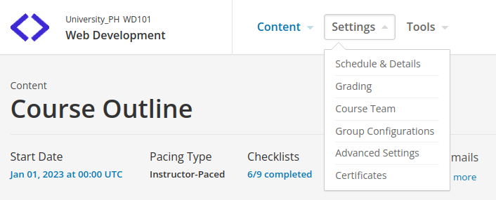
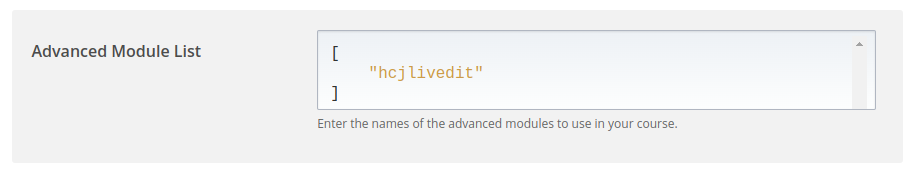
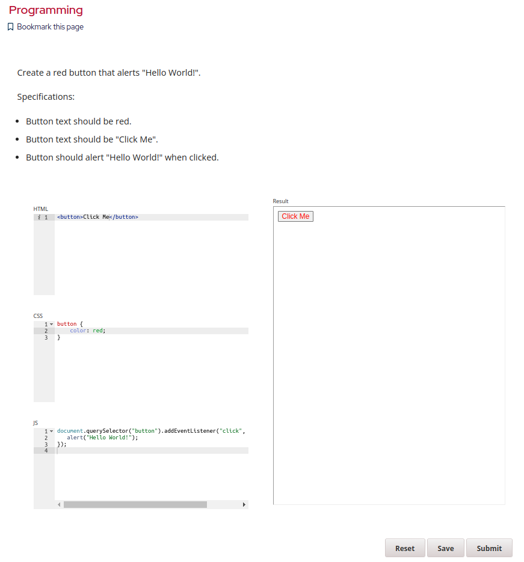
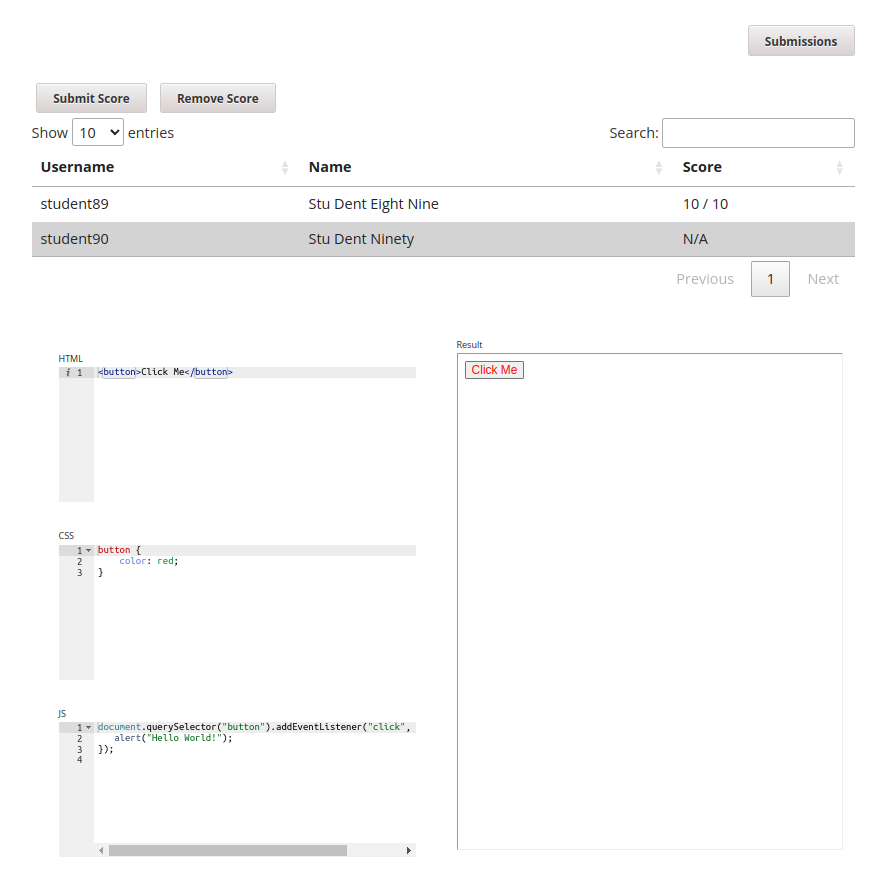
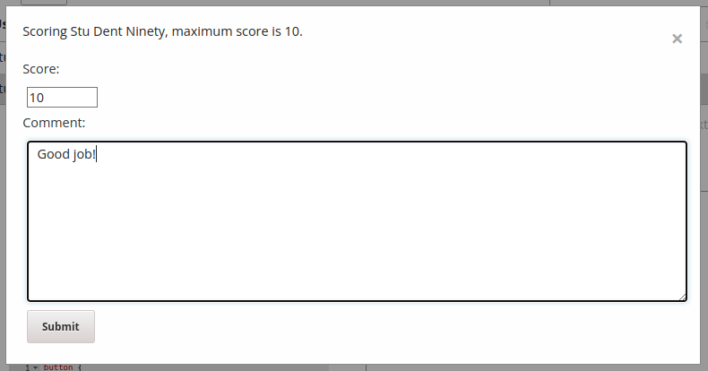
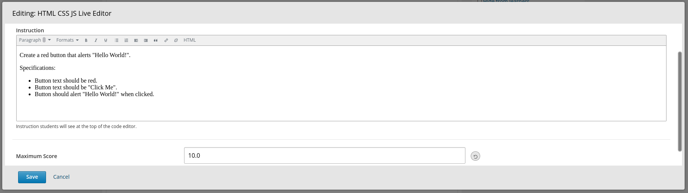

# HTML CSS JS Live Editor

This XBlock provides a live editor for HTML, CSS and JS. This allows instructors to create web development coding problems for students to solve. Instructors can then score student submissions and give feedback.

## Installation (Tutor)

Add dependency to private.txt (Recommended):

```
echo "git+https://github.com/lafbelmonte/xblock-hcjlivedit.git" >> "$(tutor config printroot)/env/build/openedx/requirements/private.txt"
```

Rebuild openedx image:

```
tutor images build openedx
```

### Setting up a course

Go to your course's outline page in the studio and look for the Advanced settings link in the top menus.



Once there look for _Advanced Module List_ and add entry `"hcjlivedit"`.



A _HTML CSS JS Live Editor_ should now be available in _Advanced Component_.


## Problem Example

### Student View



* Students can see the instructions provided by instructors.
* Live editors for HTML, CSS and JS are provided to students for solving the problem.
* Submit button is provided to submit code and be scored by instructors.
* Save button is provided to save student code state.
* Reset button is provided to reset student code state.

### Instructor View



* Instructors can see the list of submissions from the students through the table and live editor.
* Remove score button is provided to reset student score.
* Submit score button is provided to open a modal and score the student.

**Submit Score Modal**



* Score and comment will appear at the bottom of student view once they are available.

### Studio View



* Display Name field is provided for setting up component name.
* Instruction field is provided for displaying instructions to the students.
* Maximum Score field is provided for setting up the maximum score a student could get for this component.

## Tests
```
tox
```
## Improvements

* Add more tests.
* Language support.


